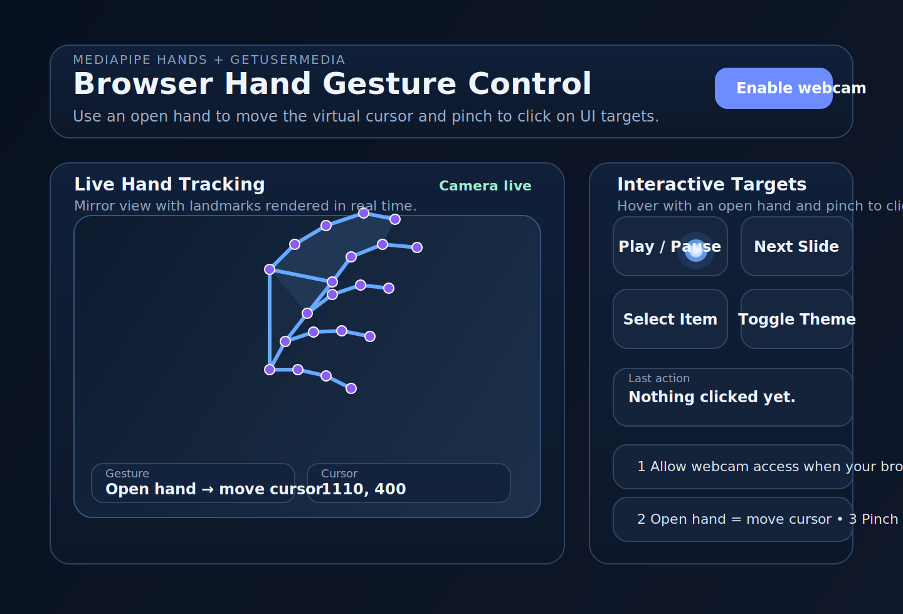

# Hand Gesture Control

A browser-based hand gesture control demo built with **HTML**, **CSS**, and **JavaScript** using **MediaPipe Hands**.



## Overview

This project uses the webcam to detect a single hand in real time and map simple gestures to browser interactions:

- **Open hand** → moves a virtual cursor smoothly across the page
- **Pinch** → performs a click on the element under the virtual cursor

The app renders:

- a live mirrored webcam feed
- MediaPipe hand landmarks and connectors
- a floating virtual cursor
- interactive demo targets for testing the gesture controls

## Features

- MediaPipe Hands running directly in the browser
- Webcam access through `getUserMedia`
- Live hand tracking overlay
- Gesture detection for cursor movement and click actions
- Smoothed cursor motion using interpolation
- Responsive, polished UI
- No build step required

## How to run locally

Because webcam access typically requires a secure context, run the project from **localhost** instead of opening the HTML file directly from disk.

### Option 1: Python

```bash
cd hand-gesture-control
python -m http.server 8000
```

Then open:

```text
http://127.0.0.1:8000
```

### Option 2: VS Code Live Server

Open the `hand-gesture-control` folder and serve it with Live Server.

## Project files

- `index.html` — UI structure and MediaPipe script loading
- `style.css` — visual design, layout, and cursor styling
- `script.js` — webcam setup, MediaPipe integration, gesture detection, and virtual cursor logic
- `assets/hand-gesture-control-preview.svg` — project preview image

## Gesture behavior

### Open hand → move cursor

The app checks for an open-hand posture by looking at finger extension landmarks and updates the virtual cursor position using the tracked hand center.

### Pinch → click

A pinch is detected when the thumb tip and index tip move within a small threshold. When the gesture transitions into a pinch, the app triggers a click on the element beneath the virtual cursor.

## Notes

- This is a **browser UI demo**, so it controls a virtual cursor inside the page rather than the system mouse pointer.
- Best results come from using a well-lit environment with one hand clearly visible to the camera.
- MediaPipe assets are loaded from CDN, so internet access is required the first time the page loads.
